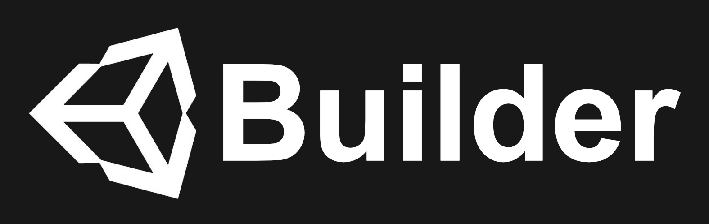
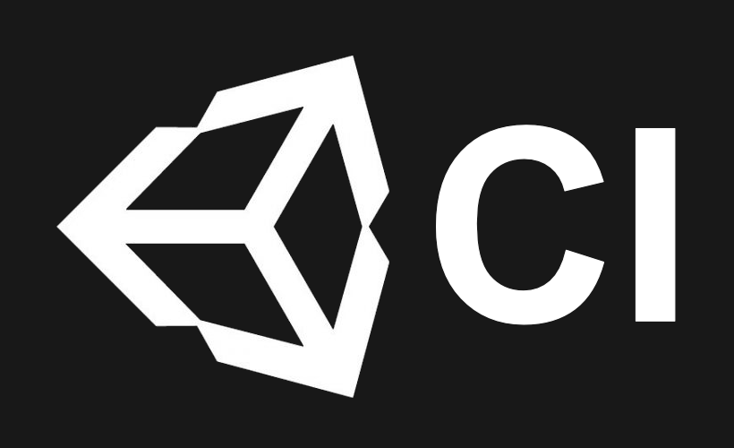

 
 

GitHub Action to
[build Unity projects](https://github.com/marketplace/actions/unity-builder)
for different platforms.

Part of the  open source project.
 
 

 
 

## How to use

Find the
[docs](https://unity-ci.com/docs/github)
on the Unity CI
[website](https://unity-ci.com/).

## Related actions

Visit the

status repository for related Actions.

## Community

Feel free to join us on

and engage with the community.

## Contributing

To help out sharpen the documentation, please find the docs [repository](https://github.com/Unity-CI/Website).

To contribute to Unity Builder, kindly read the [contribution guide](./CONTRIBUTING.md).

## Licence

[MIT](./LICENSE)
